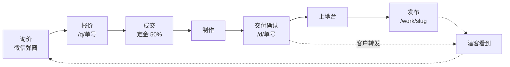
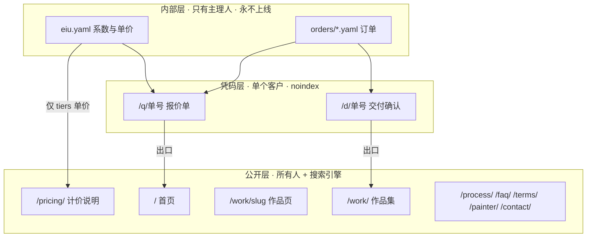
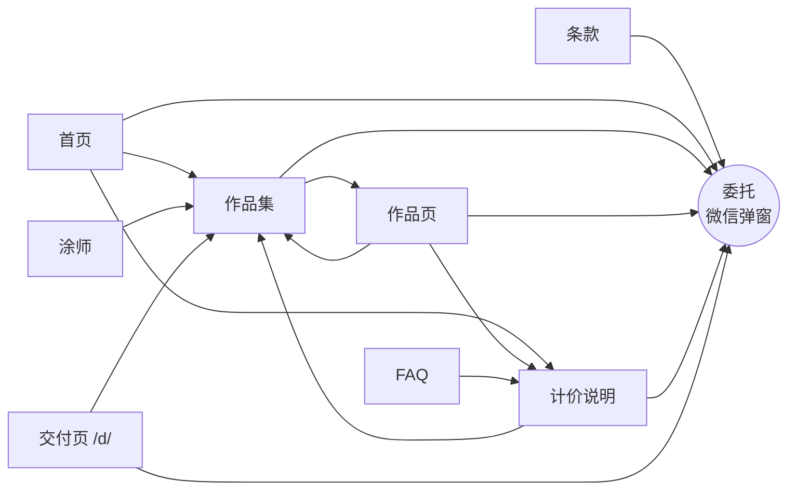

# VIIYD 架构

> ⚠️ **2026-09-03 注**：本文写于 4.0 改版之前，描述的信息架构与 4.0 已有出入（页面收敛为 首页/作品/服务与计价/关于，旧的 rates/process/contact/painter 已退役为重定向）。当前架构以 `CLAUDE.md` 与 `DOCS/REDESIGN_4.0_PLAN.md` 为准。


> 本文是 VIIYD 全站的结构定义：内容怎么分、流程怎么走、谁能看到什么、前端据此怎么设计。
> **七个模块已全部写完**。第 7 节含架构图与可直接粘贴的 design 提示词。
>
> 关联文件：
> - `DOCS/CONTENT_INVENTORY.md` —— 内容补齐工作表（待填项）
> - `F:\my_ai\baojia\eiu.yaml` —— EIU 计价数据（唯一来源，内部）
> - `F:\my_ai\design_inspiration\` —— 94 站调查库
> - `CLAUDE.md` —— 图片三级加载架构、灯箱契约、质量门禁（不在本文重复）

| 模块 | 状态 |
|---|---|
| 1 · 总纲：一条主线，三层可见性 | ✅ 已定 |
| 2 · 内容模型 | ✅ 已写（档位命名待 D1） |
| 3 · 计价与报价流程 | ✅ 已写 |
| 4 · 交付流程 | ✅ 已写 |
| 5 · 公开站信息架构 | ✅ 已写（D1/D3/D4/D6 待拍板） |
| 6 · 技术架构 | ✅ 已写 |
| 7 · 前端设计交接说明 | ✅ 已写（含架构图与 design 提示词） |

---

## 1 · 总纲：一条主线，三层可见性

### 1.1 问题的形状

站点混乱的根源不是页面太多，而是**该私密的和该公开的混在一起**，且一个订单的生命周期被切成六段，每段用不同的工具、不同的词汇、不同的价格。

一个订单现在的走法：

| | 环节 | 在哪 | 状态 |
|---|---|---|---|
| 1 | 潜客看到作品 | 公开站 `/work/` | 正常 |
| 2 | 询价 → 微信弹窗 → Telegram | Worker + D1 | 正常 |
| 3 | 按 EIU 算价、手写 HTML、导 PDF、微信发 | 本地 `baojia/` | **脱离系统** |
| 4 | 客户确认，付 50% 定金 | 微信 | 正常 |
| 5 | 涂完拍照、写文章发布 | 公开站 `/work/` | **私密内容放在公开处** |
| 6 | 客户确认后上地台，换图覆盖 | 公开站 `/work/` | 派生问题 |

第 6 段之所以成为问题，只因第 5 段放错了位置。**把第 5 段挪走，第 6 段自动消失。**

### 1.2 主线：订单号

一个订单从询价到发布，全程用一个 ID 串起来。

现有两套 ID 互不知道对方存在：报价单的 `BJ-2026-09-01`、D1 schema 的 `VY-2026-0524-K7`。**合并为一套**，格式待第 6 节定义。

```
询价 → 报价 → 成交 → 制作 → 交付确认 → 上地台 → 发布
└─────────────── 同一个订单号 ───────────────┘      └─ 公开作品页
```

### 1.3 三层可见性

| 层 | 谁能看 | 内容 | 收录 | 机制 |
|---|---|---|---|---|
| **公开层** | 所有人 + 搜索引擎 | 发布版作品、计价说明、流程、条款、FAQ、关于 | ✅ 进 sitemap | 静态站 |
| **凭码层** | 单个客户 | 报价单、交付确认页 | ❌ noindex、不进 sitemap | 链接 + 取件码，Worker 校验 |
| **内部层** | 只有主理人 | EIU 系数表、底价系数、让价空间、成交记录 | ❌ 永不上线 | 本地文件 |

三层的判定标准只有一条：**这份内容是给一个人看的，还是给所有人看的。**

凭码层的关键性质：**可分享 ≠ 可收录**。客户拿到链接和码可以自由转发（这正是"让交付页带来更多客人"的原意），但搜索引擎抓不到，公开站的 SEO 权重不会被半成品稀释。

### 1.4 这个分层顺带解决的问题

| 原来的问题 | 为什么消失 |
|---|---|
| 首页 hero 展示未上地台的交付版 | 交付版不再进公开站 |
| 搜索引擎收录半成品 | 同上 |
| 报价靠手写 HTML 转 PDF | 报价单从订单数据生成，网页即成品 |
| EIU 体系与网站零连接 | EIU 成为唯一价格来源，计价说明页讲的就是它 |
| 几百张确认图占用公开站 | 移入凭码层，公开站可以做得克制 |
| 作品页要同时伺候客户和潜客 | 拆成两种页，各自按各自目标设计 |

---

## 2 · 内容模型

### 2.1 页面类型清单

**公开层**

| 类型 | 路由 | 数量 | 现状 |
|---|---|---|---|
| 首页 | `/` | 1 | 有，需重做 |
| 作品页 | `/work/<slug>/` | 56 | 有 |
| 作品集 | `/work/` | 1 | 有，无筛选 |
| 计价说明 | `/pricing/` | 1 | **无**（现 `rates` 是价目表，非说明） |
| 流程 | `/process/` | 1 | 有，被 noindex |
| 条款 | `/terms/` | 1 | **无**（内容已存在于报价单，未上站） |
| FAQ | `/faq/` | 1 | **无** |
| 涂师 | `/painter/` | 1 | 有 |
| 关于 | `/about/` | 1 | 有，被 noindex |
| 联系 | `/contact/` | 1 | 有，被 noindex |

**凭码层**

| 类型 | 路由 | 说明 |
|---|---|---|
| 报价单 | `/q/<单号>` | 从订单数据生成 |
| 交付确认 | `/d/<单号>` | 复用现有灯箱与三级图片架构 |

**内部层**（本地文件，不进仓库不上线）

| 文件 | 作用 |
|---|---|
| `baojia/eiu.yaml` | 档位单价 + 各体系系数，唯一价格来源 |
| `baojia/orders/<单号>.yaml` | 单个订单数据 |
| `baojia/*.md` | 各体系标定表与规矩 |

### 2.2 档位词汇：一套词，两处用

⚠️ **依赖 D1**。下列为建议方案，D1 定了改本节即可，其余模块不受影响。

档位既是**报价档位**，也是**作品分类**——同一套词。客户在作品集里筛"精细展示级"，看到的就是买这个档位能得到什么。**作品集因此成为定价的证据**，而不只是画廊。

Siege、White Weasel、Skupple 均采用此结构（每个档位一个独立图库分区）。

| id | 中文 | 英文 | ¥/EIU | 现有 5 档映射 | 篇数 |
|---|---|---|---:|---|---:|
| `tabletop` | 桌面游戏级 | Tabletop | 40 | Battleline | 6 |
| `display` | 精细展示级 | Display | 90 | Specialist + Spec Ops | 34 |
| `collection` | 收藏展示级 | Collection | 200 | Master + Legend | 15 |

单价来自 `eiu.yaml` 的 `tiers`，是三层里唯一**跨层共享**的数据：内部层定义，公开层展示，凭码层计算。

### 2.3 作品页字段规范

现状：56 篇共用过 27 个字段，其中 4 组语义重复、1 个已废弃。

**保留 · 必填**

| 字段 | 说明 |
|---|---|
| `title` `date` `summary` `description` | 基础 |
| `cover` | R2 地址，`_NN` 格式 |
| `tags` | 题材／阵营／单位类型 |
| `photos` | 图版数量，驱动 plates 网格与灯箱（见 CLAUDE.md） |
| `tier` | 档位，取 2.2 的三个 id 之一 |
| `paints` | 用漆清单，含 hex 与官方链接 |

**保留 · 可选**

`time_log`（54 篇有）· `model_count`（54）· `optimized`（29）· `faction` · `scale` · `kit` · `painters_note` · `varnish`

**新增**

| 字段 | 说明 |
|---|---|
| `order_id` | 关联订单号，打通主线。早期作品留空 |
| `featured` | 首页主图钦定标记（⚠️ 依赖 D6） |

**废弃与合并**

| 废弃字段 | 篇数 | 处理 |
|---|---:|---|
| `photo_count` | 3 | → 合并进 `photos` |
| `piece_count` | 2 | → 合并进 `model_count` |
| `hero_orientation` | 1 | → 删除。首屏已改为比例自适应（A1），此字段不再有作用 |
| `hero_title` `title_accent` | 3 | → 收敛为 `tagline` 单一字段 |
| `file_no` | 3 | → 升级为 `order_id` |
| `subject` `base` | 各 1 | → 并入 `summary` 正文 |

`share_tags` `share_caption`（各 4 篇）保留——渠道发布用，见 `DOCS/MARKETING/CHANNELS.md`。

**审计脚本同步**：`scripts/audit_content.js` 的 tier 枚举需改为三档；新增 `photos` 与 `photo_count` 并存检测。

### 2.4 订单数据模型

一份订单 YAML 贯穿报价与交付两个阶段。

```yaml
id: BJ-2026-09-01
date: 2026-09-01
valid_days: 15                # 报价有效期

client:
  name: "客户称呼"
  contact: "微信 · xxx"
  code: "8472"                # 取件码，凭码层校验用

faction: grand_cathay         # 对应 eiu.yaml 的 factions key
tier: tabletop                # 对应 eiu.yaml 的 tiers id

lines:
  - unit: "农民兵"            # 对应 eiu.yaml units 的 name
    qty: 30
    base: "25mm 方形"
    note: "重复度高，流水线作业"
    coefficient: 1.00         # 省略则取 eiu.yaml 默认；议价时改这里

terms:
  deposit: 0.5                # 定金比例
  weeks: "3-4"
  starts: "收到全部模型之日起算"
  shipping: "泡棉分格＋气柱，顺丰到付"

settled: 3798                 # 成交后回填，用于养系数
```

**计算规则**：`小计 = qty × coefficient × tiers[tier].price`，`总额 = Σ小计`。
议价改 `coefficient`，永不改 `tiers[].price`（A8）。

### 2.5 内容与可见性的对应

| 内容 | 层 | 谁写 | 何时 |
|---|---|---|---|
| 订单 YAML | 内部 | 主理人 | 报价前 |
| 报价单页 | 凭码 | 系统生成 | 报价时 |
| 交付确认页 | 凭码 | 系统生成 | 交付时 |
| 作品页 | 公开 | 主理人 | 上地台后 |
| 计价说明页 | 公开 | 系统取 `tiers` + 人工正文 | 一次性 |

同一批照片在三层的用法不同：交付页用全部图版（几百张，密集灯箱），作品页只用精选（发布版，克制）。**图片三级加载架构（CLAUDE.md）在两层通用，不需要改。**

---

## 3 · 计价与报价流程

### 3.1 计价公式与数据流

```
应付金额 ＝ Σ（件数 × 系数）× 档位单价
```

三个输入，三个来源：

| 输入 | 来源 | 谁能改 |
|---|---|---|
| 件数 | 订单 YAML 的 `lines[].qty` | 主理人 |
| 系数 | `eiu.yaml` 的 `factions[].units[].quote`，订单可覆写 | 主理人（议价时） |
| 档位单价 | `eiu.yaml` 的 `tiers[].price` | **恒定，议价时不动**（A8） |

```
eiu.yaml ──┐
           ├──→ 计算 ──→ /q/<单号> 报价单页
订单.yaml ─┘                    ↓
                          客户看到明细，谈系数
                                ↓
                       成交 → settled 回填订单 YAML
                                ↓
                     累积成交记录 → 反过来修订 eiu.yaml
```

**闭环的关键在最后一步**：每单回填 `settled`，攒够样本后系数由真实成交数据养出来，不再依赖单一样本标定。EIU 标定表第五节已写明此要求，但此前无处存放。

### 3.2 报价页不是账单

报价单的用途是**建立谈判的共同结构**（A10）。它要做到三件事：

1. **给一个可横向比价的锚点** —— "基础步兵 ¥40 一个"。客户去问别家立刻知道贵不贵，这是信任的来源。
2. **把讨论从总价转移到系数** —— 客户看到"陶俑 = 10 个农民兵"，他心里有自己的数（可能是 8），谈判发生在这一列。没有这个结构，客户只能对着总价砍，砍完双方都不知道让在哪。
3. **留出他自己判断的余地** —— 系数是主观的（A11），不必假装精确。

因此页面的语气不是"这是账单，请付款"，而是"这是我怎么看这批活的工作量，哪条你觉得不对，跟我说"。

页面的结构约束见 7.5。

### 3.3 报价单页面结构

沿用现有三张报价单的分节，不另起炉灶：

| 节 | 内容 | 数据来源 |
|---|---|---|
| 页眉 | 单号 · 日期 · 报价有效期 · 选定档位与单价 | 订单 YAML |
| 一 | 计价方式说明 + 三档单价表 + 打包价声明 | `eiu.yaml` 的 `tiers` |
| 二 | 单位识别与涂装标准（分组：角色／精英／步兵／伴生兽等，每行含中英文名、底座尺寸、涂装要点） | 订单 YAML 的 `lines[]` |
| 三 | 工作量核算与价格明细（单位 · 件数 · 系数 · EIU，分组小计，合计） | 计算结果 |
| 四 | 工期与付款（起算时间 · 制作周期 · 进度反馈 · 付款方式 · 物流） | 订单 YAML 的 `terms` |
| 五 | 说明条款 | 模板常量 |

**打包价声明**（每单必须出现）：拼装、水贴等工序含在总价内，不逐项拆分计价。

### 3.4 议价规则

| 规则 | 说明 |
|---|---|
| 只降系数，不动单价 | ¥40/EIU 是锚点。打总额折扣等于把单价降到 ¥36，锚点作废 |
| 从高系数单位往下让 | 基础步兵单价透明，客户可横向比价，不留空间；角色类无横向可比价，让价空间天然集中于此 |
| 让到底价系数为地板 | 低于即亏工时，宁可不接（星际战士表已有此列；震旦样本不足，暂用单列） |

**反例**：BJ-2026-09-01 的 9 折打在总额上，等效单价 ¥40 → ¥36。同样让 ¥422，应改为从陶俑 10.00 → 9.00、妙影 5.00 → 4.50 逐项让出。

### 3.5 三种客人，三种用法

同一套 EIU，正向、反向、不报价：

| 客人类型 | 用法 | 页面表现 |
|---|---|---|
| 标准客 | 正向：算 EIU × 单价 = 报价 | 完整报价单 |
| 预算客（"我预算 200，你接不接"） | 反向：算出这批多少 EIU，再看这个预算落在哪个档位 | 同一张单，换档位单价即可给出三个价 |
| 熟客（自己报价） | 只给锚点与工作量，价格留空 | 显示 EIU 合计与档位单价，不显示总额 |

第三种是已在使用的做法：熟客自报价，主理人确认。**关键是给锚**——只告诉他"这批 105.5 EIU、桌面游戏级 ¥40/EIU 起"，剩下他自己填。有锚点的自主定价与无锚点完全不同：无锚时他要猜底线，有锚时他知道自己在往上加多少。

### 3.6 公开的计价说明页

公开层的 `/pricing/` 讲**方法**，不给价目表。

**公开**

- EIU 的定义：1 EIU = 一名基础步兵的完整工作量
- 计价公式：`Σ（件数 × 系数）× 档位单价`
- 三档单价与工艺标准（`eiu.yaml` 的 `tiers`，唯一跨层共享的数据）
- 打包价范围（含拼装、水贴）
- 一个真实算例（可用 BJ-2026-09-01 脱敏后示范）

**不公开**

- 系数表本身
- 底价系数与让价空间
- 成交记录

94 站调查中无一家把计价逻辑讲到这个程度——The Vanus Temple 的"官价倍数"最接近，但没有系数概念。**这是现成的差异化，且不需要新内容，只需要把已有的东西讲出来。**

⚠️ 依赖 D2：是否同时标注美元。鉴于国际接单不现实（A6），建议仅人民币，英文版括注约合美元供参考。

---

## 4 · 交付流程

### 4.1 交付页存在的理由

一次交付有几百张图，微信发不了，逐张发客户也看不清。**交付页是替代"发一堆照片"的工具**，不是营销页。

它服务一个已成交的客户，目标是让他能看清每一处细节并给出确认。这与作品页的目标（让潜客十秒被镇住）相反，因此必须是两种页。

| | 交付确认页 `/d/<单号>` | 作品页 `/work/<slug>` |
|---|---|---|
| 看的人 | 单个客户 | 所有人 |
| 图量 | 全部图版，几百张 | 精选 |
| 版式 | 密集网格，快速点开放大 | 克制，留白 |
| 状态 | 未上地台的初期版 | 地台完成的发布版 |
| 收录 | 否 | 是 |

### 4.2 A3／A4 在新架构下失效

这两条是在"交付版和发布版共用 `content/work/` 同一个页面"的前提下拍的：

- **A3** 发布版覆盖原页面，URL 不变
- **A4** 不做 `stage` 状态字段，接受 2-3 天缓冲期不美观

三层分开之后，两者指向不同 URL（`/d/<单号>` 与 `/work/<slug>`），**没有任何东西被覆盖，也没有缓冲期**：

```
交付页 /d/BJ-2026-09-01   ← 客户的链接，一直有效，从不进公开站
作品页 /work/<slug>       ← 上地台后新建，公开
```

A4 的结论仍然成立（不需要 `stage` 字段），但理由变了：不是"窗口太短不值得建机制"，而是**两种内容本来就在不同的层，不需要用字段区分**。

⚠️ 需确认：客户确认后，交付页是停留在初期版，还是同步更新为完成图？后者客户回看时体验更好，成本是多传一次图。建议同步更新。

### 4.3 图片流水线（复用现有约定）

交付页与作品页**共用同一套图片命名与三级加载架构**（见 `CLAUDE.md`），不新增任何机制：

```
need_upload/ → rename_images.js → [PREFIX]_01.._NN.webp + _web.webp
             → fast_upload_r2.js → R2: <年>/<月>/<CODE>/
```

交付页从订单 YAML 取前缀与数量，按 `[PREFIX]_01.._NN` 推导图版列表——与 `layouts/work/single.html` 的 plates 网格逻辑完全一致。

订单 YAML 新增：

```yaml
delivery:
  prefix: "2026/09/cathaygate/viiyd20260901cathaygate"
  photos: 16
  optimized: true
  updated: 2026-09-01
```

灯箱契约不变：`data-web-src` 打开时显示 1600px 版，`data-full-res` 点击放大加载原图。**"要看笔触细节时才付出流量"这条设计在交付场景下比在公开站更重要**——客户就是来看细节的。

### 4.4 客户确认回路

```
客户点「确认」 → POST /api/confirm { order_id, code }
              → D1 更新 status = confirmed
              → Telegram 通知主理人
              → 页面显示已确认状态与时间
```

复用现有 `contact-handler` worker 的模式（Pages Function 代理 → worker 持有 binding 与 secret），不新增部署单元。

确认按钮之外，交付页还需要一个**留言框**——客户看图时会有"这个红能不能再深一点"这类反馈，现在这些散落在微信里，与图版对不上号。留言应携带图版编号。

### 4.5 交付页的生命周期

| 阶段 | 状态 |
|---|---|
| 生成 | 报价成交后，图拍完上传后 |
| 确认中 | 客户查看、留言、确认 |
| 已确认 | 状态锁定，留言仍可见 |
| 长期 | **保留，不删除**。客户可能回看，链接需持续有效 |

不设过期。取件码不轮换（除非客户要求）。交付页始终 `noindex`、不进 sitemap，但链接可自由转发——这正是"让交付页带来更多客人"的原意（三层可见性 1.3）。

### 4.6 从交付到发布

上地台完成后，主理人从交付图版中挑选，新建 `content/work/<slug>`：

| 动作 | 说明 |
|---|---|
| 挑图 | 从几百张里选出发布版图版，重新走一次 `rename_images.js` |
| 写内容 | 双语 `index.md` / `index.zh.md`，frontmatter 按 2.3 规范 |
| 关联 | 填 `order_id`，打通主线 |
| 档位 | `tier` 取实际交付档位，与报价单一致 |

**不是所有订单都发布。**客户不愿公开、或成品不足以代表水准的，交付页照常存在，公开站不出现。这是三层架构给出的自由度——此前所有交付都被迫进公开站。

---

## 5 · 公开站信息架构

> 本模块只定义**结构与数据**：有哪些页、页与页怎么连、每页暴露什么字段、什么可筛可查可分享。
> 视觉表现（版式、密度、尺寸、配色）不在本模块，属模块 7 交给设计。
> 含 4 个未拍板项（D1 / D3 / D4 / D6），已按建议默认写入并标注 ⚠️。

### 5.1 公开站承担什么

交付、报价、确认全部移入凭码层之后，公开站不再承担客户服务职能，只剩两件事：

1. **证明水准** —— 作品数据可被浏览、筛选、比较
2. **给出入口** —— 任何页面都能一步到达委托

衡量口径：产生一次微信咨询。

### 5.2 入口地图

| 流量入口 | 落地页 | 访客已知 | 该页必须回答 |
|---|---|---|---|
| 搜索「成都 战锤 涂装」 | `/` | 几乎为零 | 你是谁、水准、多少钱 |
| 搜索具体单位名／技法 | `/work/<slug>/` | 只知这一件 | 还有别的吗、谁画的 |
| 小红书／Instagram 图片 | `/work/<slug>/` | 见过一张图 | 同上 |
| **他人转发的交付页** | `/d/<单号>` | 见过几百张图 | **这是谁、怎么找他** |
| 老客户直接输域名 | `/` | 全知 | 委托入口在哪 |

第四行是当前**完全断掉的一条**，见 5.6。

### 5.3 页面出口矩阵

每个页面必须存在明确的"下一步"，无死端。

| 页面 | 主出口 | 次出口 |
|---|---|---|
| `/` 首页 | 作品集 | 计价说明 · 委托 |
| `/work/` 作品集 | 作品页 | 筛选态自身 · 委托 |
| `/work/<slug>/` 作品页 | 同档位作品集 · 同题材作品集 | 计价说明 · 委托 |
| `/pricing/` 计价说明 | 委托 | 各档位对应的作品集分区 |
| `/process/` 流程 | 委托 | 条款 |
| `/faq/` 常见问题 | 委托 | 条款 · 计价 |
| `/terms/` 条款 | 委托 | — |
| `/painter/` 涂师 | 作品集 | 委托 |
| `/contact/` 联系 | 委托 | — |
| `/d/<单号>` 交付页 | **作品集**（见 5.6） | 委托 |

「委托」= 微信弹窗，全站唯一主行动，不是独立页面。

### 5.4 作品集的查询能力

这是"保持信息量、可查询"的实质部分。56 篇作品的 frontmatter 里已有足够字段，问题是没有被查询接口暴露出来。

**可筛维度**

| 维度 | 字段 | 取值 | 说明 |
|---|---|---|---|
| 档位 | `tier` | ⚠️D1 三档 | 主筛选，与报价档位同词（见 2.2） |
| 题材／阵营 | `tags` | 震旦 · 星际战士 · 混沌 · 帝国 … | 多选 |
| 单位类型 | `tags` | 步兵 · 角色 · 载具 · 巨型 … | 需在 tags 中规范化，现无统一约定 |
| 年份 | `date` | 2024–2026 | |

**可排序维度**

| 排序 | 字段 | 用途 |
|---|---|---|
| 时间 | `date` | 默认，新→旧 |
| 规模 | `model_count` | 找"他接过多大的单" |
| 投入 | `time_log` | 找"他愿意在一件上花多久" |

**可搜索**：`title` · `tags` · `paints[].name`（按颜料搜是同行流量入口）

**每条记录暴露的字段**

| 视图 | 暴露字段 |
|---|---|
| 网格 | cover · title · tier · date |
| 列表 | cover 缩略 · title · tier · `model_count` · `time_log` · tags · date |

列表视图的存在理由：`time_log` 与 `model_count` 只有在同屏并排时才产生比较价值，网格做不到。**这两个字段是 94 站调查中没有第二家提供的数据**，不暴露等于白记。

**结果计数**：始终显示「共 56 件 · 当前筛选 12 件」。

**分页**：按批加载，不做无限滚动——需要可被搜索引擎抓取的分页 URL。

### 5.5 筛选状态进 URL

筛选结果必须有独立、可分享、可收录的 URL：

```
/work/                      全部
/work/tier/display/         档位筛选
/work/tag/grand-cathay/     题材筛选
/work/tier/display/?tag=grand-cathay&sort=hours
```

前两级用 Hugo taxonomy 静态生成（可被收录，是 SEO 资产：「震旦 涂装」这类长尾词的落地页）；组合筛选与排序走查询参数，客户端处理。

**技术边界**：Hugo 是静态站，组合筛选与搜索需要构建期产出一份索引：

```
/index.json   ← 全部作品的 slug / title / tier / tags / date / model_count / time_log / cover / paints[].name
```

客户端读此文件做筛选与搜索，无后端依赖。文件体积按 56 篇估算在可接受范围，超出后再考虑分片。

### 5.6 交付页通往公开站的出口

**当前完全缺失，且这正是「让交付页带来更多客人」失败的原因。**

客户把交付页转发给朋友，朋友看完几百张图，页面没有任何去处——不知道这是谁、更多作品在哪、怎么委托。

交付页 `/d/<单号>` 底部必须有：

| 元素 | 去向 |
|---|---|
| 工作室署名 | `/` |
| 「更多同类作品」 | `/work/tag/<该单题材>/` |
| 委托入口 | 微信弹窗 |

交付页本身仍 `noindex`、不进 sitemap——**转发可达，搜索不可达**（见 1.3）。

### 5.7 站点地图与页面数据

| 路由 | 数据来源 | 必含区块 | 现状 |
|---|---|---|---|
| `/` | 钦定作品 ⚠️D6 · 最近作品 · `eiu.yaml` 的 `tiers` | 首屏作品 · 身份陈述 · 作品列表 · 计价锚点 · 委托 | 有，需重做 |
| `/work/` | 全部发布版作品 + `/index.json` | 筛选栏 · 结果计数 · 列表 | 有，无筛选 |
| `/work/<slug>/` | 单篇 frontmatter + plates | 图版 · 元数据（档位/件数/工时/题材）· 用漆清单 · 同档位与同题材出口 | 有 56 篇 |
| `/pricing/` | `eiu.yaml` 的 `tiers` + 人工正文 | EIU 定义 · 公式 · 三档单价 · 打包范围 · 一个算例 | **新建**，替代 `rates` |
| `/process/` | 现有四阶段 | 分析／备战／涂装／部署 | 有，⚠️D3 解除 noindex |
| `/faq/` | 14 条问答 | — | **新建**，答案待填 |
| `/terms/` | **报价单第四、五节现成** | 定金 50% · 3–4 周 · 收齐模型起算 · 顺丰到付 · 有效期 15 天 | **新建**，搬运即可 |
| `/painter/` | 现有 | 主理人 · 工作室 | 有 |
| `/contact/` | 现有 | 微信 · 邮箱 · 城市 | 有，⚠️D3 解除 noindex |

**`/about/` 与 `/painter/` 内容重叠**（两页都在讲工作室与主理人），合并为 `/painter/`，`/about/` 做 301。

### 5.8 导航

⚠️ **D4 建议默认**：顶栏 5 项，其余入页脚。

```
顶栏   作品 · 计价 · 流程 · 涂师 · [委托]      EN·ZH
页脚   条款 · FAQ · 联系 · Instagram · 小红书 · © VIIYD Chengdu
```

现状顶栏只有「作品／涂师」，且在 `layouts/index.html` 里写死，**需改为读 `hugo.toml` 的 `menu.main`**，否则每次改导航要动模板。

### 5.9 中英文分工

依据 A6：国际接单不现实（运费过高），客源以本地与周边为主。

| | 中文站 | 英文站 |
|---|---|---|
| 角色 | 接单主场 | 背书与曝光，非接单入口 |
| 计价 | 完整 EIU 说明，人民币 | 同页，人民币为主，括注约合美元 |
| 描述 | 成都本地 + 全国寄件 | 「中国成都的工作室」，供国际读者了解 |

`hugo.toml` 英文描述现写着 "two display slots open each quarter"，是奔着接国际单去的，需改写。

### 5.10 URL 与收录规则

| 范围 | 收录 | sitemap | robots |
|---|---|---|---|
| 公开层全部页面 | ✅ | ✅ | 允许 |
| taxonomy 筛选页（档位／题材） | ✅ | ✅ | 允许——长尾词落地页 |
| 组合筛选（查询参数） | ❌ | ❌ | `noindex` meta |
| `/q/*` `/d/*` | ❌ | ❌ | **`robots.txt` 明确禁止** |

⚠️ **D3 建议默认**：`rates`／`process`／`about`／`contact` 四页解除 `noindex` 与 `sitemap.disable`。此为上一版改造遗留，非有意设计——首页也未链接它们，搜索引擎与访客都到不了。

凭码层的 `noindex` 是硬要求：否则客户报价单会被搜索出来。

## 6 · 技术架构

### 6.1 现状拓扑

| 单元 | 位置 | 部署状态 | 说明 |
|---|---|---|---|
| Hugo 静态站 | Cloudflare Pages | ✅ 在跑 | |
| `functions/api/commission.js` | Pages Function | ✅ 在跑 | 仅做代理转发 |
| `workers/contact-handler/` | Worker | ✅ 在跑 | 持有 D1／R2／Telegram secret |
| `workers/commission/` | Worker | ❌ 从未部署 | D1 id 与 KV id 均为空 |
| `worker/` (viiyd-worker) | Worker | ❌ 未部署 | Hono 应用，含 auth／quote／payment 三条路由 |
| D1 `viiyd-db` | | id 已填 | 无使用者 |
| D1 `commissions-db` | | id 为空 | |
| R2 `viiyd-art-photos` | | ✅ 在用 | 作品图 |
| R2 `viiyd-commission-refs` | | 未部署 | 客户参考图 |
| Turnstile | | ✅ 已配 | site key 在 `hugo.toml` |

**三个 worker 目录、两个 D1，其中两个 worker 与一个 D1 从未上线。** 这本身就是"零散"的一部分。

### 6.2 目标拓扑：收进 Pages Functions

Cloudflare Pages Functions 原生支持 D1／R2／KV 绑定，可直接承载 `/q/*` 与 `/d/*`——**不需要独立 Worker，也不需要代理跳转**。

```
Cloudflare Pages
├── Hugo 静态产物            公开层
├── functions/
│   ├── q/[id].js            报价单页        ┐
│   ├── d/[id].js            交付确认页      ├ 凭码层
│   ├── api/unlock.js        取件码校验      │
│   ├── api/confirm.js       交付确认        │
│   ├── api/note.js          图版留言        ┘
│   └── api/commission.js    委托表单（现有，暂保留代理）
└── 绑定
    ├── D1   viiyd-db        订单 · 委托 · 留言
    ├── R2   viiyd-art-photos
    └── KV   RATE_LIMIT      取件码失败计数
```

**迁移策略**：新功能直接写 Pages Functions；`contact-handler` 在跑且无问题，不动它，直到有理由动。

### 6.3 清理清单

| 对象 | 处理 | 理由 |
|---|---|---|
| `worker/`（整个目录） | 删除 | 未部署。`routes/auth.ts` `payment.ts` 是登录与 Stripe 支付，与"微信成交、无在线支付"的现实不符 |
| `worker/src/module_quote/service_pricing.ts` | 随上删除 | 第 6 套价格体系（USD $30/$80/$150/$800 × 复杂度），无调用者 |
| `workers/commission/` | 删除 | 从未部署，功能与 `contact-handler` 重复 |
| D1 `commissions-db` | 不创建 | 合并进 `viiyd-db` |
| `layouts/partials/site-header.html` | 删除 | Tailwind 遗留，全站零引用（已核实） |
| i18n `tier_standard/elite/master_label` | 删除 | 第 5 套档位词汇，无引用 |
| `content/rates/` + `layouts/_default/services.html` | 替换为 `/pricing/` | 硬编码 `$`，价格与 EIU 体系对不上 |

### 6.4 订单号

现存三种格式互不兼容：`BJ-20260827-01`、`BJ-2026-09-01`、`VY-2026-0524-K7`。

**统一为**：`VY-YYYYMMDD-NN`

- `VY` 中性前缀——同一个号要贯穿报价、交付、作品三处，不宜用 `BJ`（报价）
- 日期段无分隔符，避免上述两种 BJ 写法的分叉
- `NN` 当日序号，两位

历史三张报价单保留原号，新单起用新格式。作品 frontmatter 的 `order_id` 填此号。

### 6.5 取件码机制

```
GET  /q/VY-20260901-01        → 输入框（不泄露订单是否存在）
POST /api/unlock {id, code}   → 校验 → 签发短期令牌（Cookie，HttpOnly，2 小时）
GET  /q/VY-20260901-01        → 携带有效令牌 → 渲染报价单
```

| 项 | 规则 |
|---|---|
| 码长 | 6 位数字 |
| 存储 | D1，存哈希不存明文 |
| 失败限流 | 同一 id 连续失败 3 次锁 10 分钟，KV 计数 |
| 不存在的单号 | 返回与"码错误"完全相同的响应，不泄露订单是否存在 |
| 有效期 | 不过期。客户可能回看（见 4.5） |
| 轮换 | 仅在客户要求时 |

轻量替代（供选择）：仅用不可猜的长链接 `/q/VY-20260901-01-a7f3e9c2`，链接即凭证。代价是转发即泄露。**建议报价单加码，交付页可只用长链接。**

### 6.6 D1 表结构

在现有 `commissions` 表基础上新增两张：

```sql
-- 订单：贯穿报价与交付
CREATE TABLE orders (
  id            TEXT PRIMARY KEY,        -- VY-20260901-01
  created_at    INTEGER NOT NULL,
  code_hash     TEXT NOT NULL,           -- 取件码哈希
  client_name   TEXT,
  client_contact TEXT,
  faction       TEXT,                    -- eiu.yaml 的 factions key
  tier          TEXT,                    -- eiu.yaml 的 tiers id
  payload       TEXT NOT NULL,           -- 订单 YAML 转 JSON，见 2.4
  quoted        INTEGER,                 -- 报价金额（分）
  settled       INTEGER,                 -- 成交金额（分），成交后回填
  status        TEXT DEFAULT 'quoted',   -- quoted | accepted | painting | delivered | confirmed | published
  confirmed_at  INTEGER
);

-- 交付页留言：必须携带图版编号
CREATE TABLE notes (
  id         INTEGER PRIMARY KEY AUTOINCREMENT,
  order_id   TEXT NOT NULL REFERENCES orders(id),
  plate      INTEGER,                    -- 图版编号，NULL 表示整体留言
  body       TEXT NOT NULL,
  created_at INTEGER NOT NULL,
  author     TEXT DEFAULT 'client'       -- client | studio
);

CREATE INDEX idx_orders_status ON orders(status);
CREATE INDEX idx_notes_order   ON notes(order_id, plate);
```

`payload` 存整份订单 JSON 而非拆成列：订单结构会演进，拆列会频繁迁移。需要查询的字段（faction／tier／金额／状态）单独提列。

### 6.7 计算与生成

计算逻辑只有一处，供两个消费者共用：

```
baojia/eiu.yaml ─┐
                 ├─→ calc(order) → { lines[], eiu_total, amount }
baojia/orders/*  ─┘        ↑                    ↓
                     本地脚本（出单）      Pages Function（渲染 /q/）
```

**本地脚本**：读订单 YAML → 计算 → 写入 D1（含 `payload`、`code_hash`）→ 打印链接与取件码。
**Pages Function**：从 D1 读 `payload` → 用同一份计算逻辑渲染。

计算函数须可独立测试：纯函数，输入订单 JSON 与 EIU 表，输出金额明细，不依赖网络与文件系统。用 BJ-2026-09-01 作为固定测试样本，期望值 `105.50 EIU / ¥4,220`。

### 6.8 构建期产物

| 产物 | 用途 | 生成方式 |
|---|---|---|
| `/index.json` | 作品集客户端筛选与搜索（见 5.4） | Hugo 输出格式，仅含发布版作品 |
| `/work/tier/<id>/` | 档位 taxonomy 页，可收录 | Hugo taxonomy |
| `/work/tag/<slug>/` | 题材 taxonomy 页，可收录 | Hugo taxonomy |
| `sitemap.xml` | 排除 `/q/*` `/d/*` | Hugo 配置 |
| `robots.txt` | 明确 `Disallow: /q/` `Disallow: /d/` | 静态文件 |

`/index.json` 字段：`slug · title · tier · tags · date · model_count · time_log · cover · paints[].name`

### 6.9 质量门禁增补

现有门禁见 `CLAUDE.md`（`audit_content.js` + pre-commit hook）。新增：

| 检查 | 触发 |
|---|---|
| `tier` 枚举为三档 | ⚠️D1 定后启用 |
| `photos` 与 `photo_count` 不得并存 | 立即 |
| `model_count` 与 `piece_count` 不得并存 | 立即 |
| 计算函数样本回归（105.50 EIU / ¥4,220） | 报价功能上线后 |
| `robots.txt` 含 `/q/` `/d/` 禁止项 | 凭码层上线后 |

### 6.10 秘钥与绑定

| 名称 | 类型 | 用途 | 现状 |
|---|---|---|---|
| `DB` | D1 | 订单／委托／留言 | 需绑到 Pages |
| `RATE_LIMIT` | KV | 取件码失败计数 | 需创建 |
| `REFS_BUCKET` | R2 | 客户参考图 | 需创建 |
| `TELEGRAM_BOT_TOKEN` / `CHAT_ID` | Secret | 通知 | contact-handler 已有 |
| `TURNSTILE_SECRET_KEY` | Secret | 表单防刷 | 已有 |

取件码哈希无需额外 secret（用 Web Crypto 的 SHA-256 加每单随机盐，盐存 D1）。

## 7 · 前端设计交接说明

> 本节是给设计工具的输入。**只定义结构、数据与约束，不定义视觉风格**——配色、版式、字体、密度节奏由设计决定。
> 7.5 是可直接粘贴的提示词。

### 7.1 订单主线



同一个订单号 `VY-YYYYMMDD-NN` 贯穿全程。最后两条虚线是获客回路：发布的作品和被转发的交付页，都要能走回询价。

### 7.2 三层可见性



**唯一跨层共享的数据是 `tiers` 的三档单价**：内部层定义，公开层展示，凭码层计算。系数只在内部层与凭码层之间流动，不进公开层。

### 7.3 公开站出口图



无死端：每页都有明确下一步。「委托」是全站唯一主行动，不是独立页面。

### 7.4 每页的数据契约

| 页面 | 必须暴露的字段 | 必须存在的出口 |
|---|---|---|
| `/` | 钦定作品（cover · title · tier）· 最近作品列表 · 三档单价与基础步兵锚点价 | 作品集 · 计价 · 委托 |
| `/work/` | 筛选栏（档位 / 题材 / 单位类型 / 年份）· 排序（日期 / 件数 / 工时）· 搜索框 · 结果计数「共 56 · 当前 12」· 两种视图 | 作品页 · 委托 |
| `/work/` 网格项 | cover · title · tier · date | 作品页 |
| `/work/` 列表项 | cover 缩略 · title · tier · model_count · time_log · tags · date | 作品页 |
| `/work/<slug>/` | 图版（photos 张）· 档位 · 件数 · 工时 · 题材 · 用漆清单（名称 + 色号 + 官方链接） | 同档位作品集 · 同题材作品集 · 计价 · 委托 |
| `/pricing/` | EIU 定义 · 计价公式 · 三档单价与工艺标准 · 打包范围 · 一个真实算例 | 各档位作品集分区 · 委托 |
| `/faq/` | 14 条问答 | 计价 · 条款 · 委托 |
| `/terms/` | 定金比例 · 工期 · 起算时间 · 物流 · 报价有效期 | 委托 |
| `/painter/` | 主理人 · 工作室 | 作品集 · 委托 |
| `/q/<单号>` | 取件码输入 → 页眉（单号/日期/有效期/档位单价）· 单位识别与涂装标准 · 工作量明细（单位/件数/系数/EIU）· 合计 · 工期付款 · 条款 | 首页 |
| `/d/<单号>` | 取件码输入 → 全部图版（灯箱可放大）· 每版可留言 · 确认按钮 | 作品集 · 委托 |

### 7.5 结构约束

以下是**结构层面的硬约束**，不是风格偏好。每条都有业务理由。

| 约束 | 理由 |
|---|---|
| 作品集必须有**列表视图**，暴露 `model_count` 与 `time_log` | 这两个字段只有并排同屏才产生比较价值。94 站调查中无第二家提供此数据，不暴露等于白记 |
| 作品集必须可**筛选、排序、搜索**，且筛选状态进 URL | 访客是来评估「这人能不能干我这活」的，不是来欣赏的。且档位／题材 taxonomy 页是长尾词落地页 |
| 首屏不得占满整屏 | 一屏一张大图＝零信息量，访客不会往下翻。首屏必须露出下一块内容 |
| 作品标题不得压在模型上 | 涂装本身是产品，遮挡即遮挡卖点 |
| 图片不得裁切 | 比例由模型形态决定，版式适应照片而非相反 |
| 报价单：锚点句位置高于总额 | 锚点（基础步兵 ¥40）是横向比价与信任的来源 |
| 报价单：总额不加重强调 | 报价页的用途是建立谈判结构，不是催付。语气是「哪条你觉得不对，跟我说」，不是「请付款」 |
| 报价单：无「接受／拒绝」按钮 | 同上 |
| 交付页必须有通往公开站的出口 | 客户转发是获客路径，无出口则转发无效 |
| 全站唯一主行动是「委托」（微信弹窗） | 单一转化目标，重复出现，不与其他 CTA 竞争 |

### 7.6 给 design 的提示词

可直接粘贴至 claude.ai/design 或其他设计工具。

```text
为一家成都的战锤微缩模型手涂委托工作室（VIIYD）设计网站前端。
请给出桌面画板（1440×900），每页一块。风格由你决定，但结构和数据契约必须严格遵守。

## 业务背景

- 客单 ¥40–¥400／模型，客户主要通过微信成交，无在线支付
- 客源以本地和周边为主，国际接单不现实（运费过高）
- 已完成 56 件作品，每件记录了用漆清单（含色号与官方购买链接）和精确工时
- 计价用自研的 EIU 体系：1 EIU = 一名基础步兵的工作量 = ¥40，
  金额 = Σ（件数 × 难度系数）× 档位单价，三档单价 ¥40 / ¥90 / ¥200 每 EIU

## 访客是谁

主要访客是「评估型」，不是「欣赏型」。他打开网站是要在十秒内判断
「这个人能不能干我这活、大概多少钱、怎么开始」，不是来看画展的。
因此密度和可比较性优先于视觉冲击。

## 需要设计的页面

1. 首页 /
2. 作品集 /work/ —— 含筛选、排序、搜索，网格与列表两种视图
3. 作品页 /work/<slug>/
4. 计价说明 /pricing/
5. 报价单 /q/<单号> —— 凭取件码查看，单个客户可见
6. 交付确认页 /d/<单号> —— 凭取件码查看，几百张图，客户逐版留言并确认

## 每页必须暴露的数据

首页：钦定的一件作品（图 + 标题 + 档位）· 最近作品列表 ·
      三档单价与「基础步兵 ¥40 起」的锚点 · 委托入口

作品集：筛选栏（档位 / 题材 / 单位类型 / 年份）· 排序（日期 / 件数 / 工时）·
        搜索框 · 结果计数「共 56 件 · 当前筛选 12 件」· 网格与列表视图切换
        网格项：封面 · 标题 · 档位 · 日期
        列表项：缩略图 · 标题 · 档位 · 模型件数 · 工时 · 题材 · 日期

作品页：全部图版（可点击放大看笔触）· 档位 · 件数 · 工时 · 题材 ·
        用漆清单（漆名 + 色号 + 官方链接）· 通往同档位与同题材作品集的出口

计价说明：EIU 定义 · 计价公式 · 三档单价与各自的工艺标准 · 打包范围 · 一个真实算例

报价单：取件码输入 → 页眉（单号 / 日期 / 有效期 / 选定档位单价）·
        单位识别与涂装标准表 · 工作量明细表（单位 / 件数 / 系数 / EIU / 小计）·
        合计 · 工期与付款 · 说明条款

交付确认页：取件码输入 → 全部图版网格（点击放大）· 每版可留言 · 确认按钮 ·
            页脚有通往作品集与委托的出口

## 硬约束（有业务理由，不可协商）

- 首屏不得占满整屏，必须露出下一块内容的开头
  —— 一屏一张大图等于零信息量，访客不会往下翻
- 作品标题不得压在模型上 —— 涂装本身是产品，遮挡即遮挡卖点
- 图片不得裁切 —— 比例由模型形态决定（1:1 / 4:3 / 3:4 都有），
  版式必须适应照片，而不是照片适应版式
- 作品集必须有列表视图，且列表要暴露工时与件数
  —— 这两个数据只有并排同屏才有比较价值，是差异化资产
- 报价单：锚点句（基础步兵 ¥40 一个）的位置要高于总额；
  总额不加重强调；页面不要「接受／拒绝」按钮
  —— 报价页的用途是建立谈判结构，不是催付
- 全站唯一主行动是「委托」（微信弹窗），重复出现，不与其他 CTA 竞争
- 深色底，全站不做浅色模式

## 不要

圆角卡片堆砌 · 渐变背景 · emoji · 弹窗抓邮箱 · 客户 logo 墙 ·
把完整模型塞进 16:9 通栏裁掉头和底座

## 参考坐标

David Zwirner（画廊，作品优先、标题在作品外）·
NOMOS Glashütte（工艺品牌，通栏用的是极端微距而非完整物件）·
White Weasel Studio（同行，按等级分区的双筛选图库）

每块画板下方用一行小字说明：这一页解决访客的什么问题。
```

### 7.7 交给设计之前必须先定的事

⚠️ 下列未拍板项会直接改变设计稿，建议先定：

| # | 待定 | 影响 |
|---|---|---|
| D1 | 档位三档的中英文命名 | 作品集分区标签、计价页、报价单 |
| D4 | 顶栏放哪几项 | 每一页的顶部 |
| D6 | 首页主图是否改为人工钦定 | 首页首屏 |

D3（四个暗页是否公开）不影响设计稿，只影响 SEO 配置。

---

## 附录 A · 已拍板决定

按确定时间倒序。**这些不再重新讨论**，除非有新事实推翻。

| # | 决定 | 依据 |
|---|---|---|
| A11 | **EIU 系数不需要精确。**它是主观判断，1.5 还是 2.0 因人而异。目标是"能展示、能改、有地方放"，不是算得准 | 2026-09-02 |
| A10 | **EIU 的用途是谈价的共同语言，不是算价器。**锚点让客户能横向比价，系数是留给双方判断的余地。没有这套结构，客户只能对着总价砍 | 2026-09-02 |
| A9 | **EIU 锚在市场价，不锚在工时。**基础步兵（震旦=农民兵／星际战士=灰猎手）¥40 = 1.00 EIU，全体系统一 | 2026-09-02 |
| A8 | **议价只降系数、不动单价。**¥40/EIU 是横向比价锚点，必须恒定。打总额折扣等于破坏锚点 | EIU 标定表第五节 |
| A7 | **不做混档报价**（一单内不同单位不同档位）。定价靠灵活协商，不靠机制 | 2026-09-02 |
| A6 | **国际接单不现实**（运费过高），客源以本地+周边为主。英文站定位应改为背书与曝光，非接单入口 | 2026-09-02 |
| A5 | **网页报价的目的是替代发 PDF**——让客户点开就能看到计算过程。不追求功能复杂 | 2026-09-02 |
| A4 | **不做 `stage` 状态字段。**交付版仅存在 2-3 天，客户确认后原地址原图替换为发布版。为 2-3 天的窗口建状态机制不划算 | 2026-09-02 |
| A3 | **发布版覆盖原页面**，URL 不变，客户旧链接持续有效。接受缓冲期内不美观 | 2026-09-02 |
| A2 | **全站深色，锁定 `#050403`**，不响应 `prefers-color-scheme` | 2026-09-02 |
| A1 | **照片不裁切。**比例由模型形态决定，版式适应照片。照片四角实测为 `(0,0,0)`，与页面底色一致，边界不可见 | 2026-09-02 |

### 已核实的事实

| 事实 | 来源 |
|---|---|
| 封面照片四角像素为 `(0,0,0)`，最高 10 | PIL 实测 7 张 `_web.webp` |
| BJ-2026-09-01 震旦单：57 件 / 105.50 EIU / 报价 ¥4,220 / 9 折成交 ¥3,798 | 报价单 + eiu.yaml 验算 |
| 该单实测工时 281h，逐件记录于 `time_log` | 6 篇作品 frontmatter |
| 件数以报价单为准：门下督 2 · 农民兵 30 · 铁霄枪手 12 · 鹤枪组 8 | 2026-09-02 用户确认 |
| 站内并存 6 套价格／等级词汇 | 仓库实测，详见 CONTENT_INVENTORY 第 1 节 |
| `rates`／`process`／`about`／`contact` 四页 `noindex` 且未被首页链接 | 仓库实测 |
| 震旦角色端系数是星际战士的 2.7–3 倍 | 两张 EIU 表对照 |

---

## 附录 B · 尚未拍板

阻塞后续模块的决定，逐项见 `DOCS/CONTENT_INVENTORY.md` 第 2 节。

| # | 待定 | 阻塞 |
|---|---|---|
| D1 | 档位体系统一成几档、叫什么、55 篇作品如何映射 | 模块 2、5 |
| D2 | 货币口径（人民币为主已定，是否双币种未定） | 模块 3、5 |
| D3 | 四个暗页是否公开 | 模块 5 |
| D4 | 首页顶栏放哪几个入口 | 模块 5、7 |
| D6 | 首页主图改为人工钦定 | 模块 5、7 |

---

*本文由 /loop 逐模块推进 · 起始 2026-09-02*
