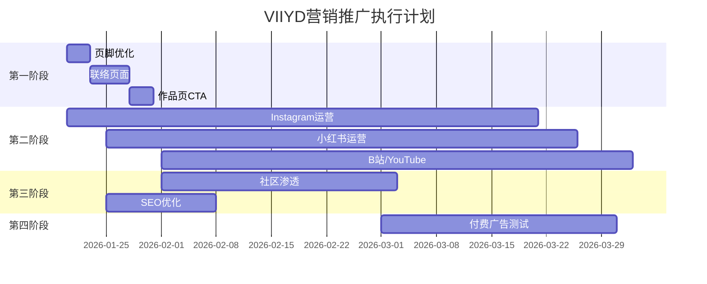

# VIIYD 网站流量引流与联络体系规划
# VIIYD Website Traffic Generation & Contact System Plan

> **项目状态**: 网站已完成初步开发，部署于 Cloudflare Pages  
> **技术栈**: Hugo + Tailwind CSS + GitHub + Cloudflare Pages  
> **目标市场**: 双语市场 (中文 + 英文) 战锤/微缩模型涂装服务

---

## 📋 联络信息汇总 (Contact Information)

| 渠道 Channel | 信息 Information | 目标用户 Target |
|-------------|------------------|-----------------|
| **Email** | maylyy8@gmail.com | 全球客户/正式询价 |
| **Instagram** | [@viiyang.yingying](https://www.instagram.com/viiyang.yingying/) | 海外爱好者/展示作品 |
| **微信 WeChat** | QR码: `/static/img/mywechat.jpg` | 中国客户/即时沟通 |
| **网站** | viiyd.com (Cloudflare Pages) | 所有潜在客户 |

---

## 🎯 第一阶段: 网站内联络优化 (Website Contact Integration)

### 1.1 页脚联络区域优化
**优先级: 🔴 高**

```yaml
任务:
  - 在页脚添加完整联络信息区块
  - 显示 Email 链接 (mailto:maylyy8@gmail.com)
  - 显示 Instagram 图标+链接
  - 显示微信二维码图片或弹窗
  - 中英文版本同步更新
```

**实施文件:**
- `layouts/partials/footer.html` - 页脚模板
- `assets/css/main.css` - 样式调整

### 1.2 专属联络页面 (Contact Page)
**优先级: 🔴 高**

```yaml
任务:
  - 创建 /contact/ 和 /zh/contact/ 页面
  - 包含联系表单 (可用 Formspree/Netlify Forms)
  - 显示所有联络方式
  - 添加营业时间/响应时间说明
  - 加入FAQ常见问题
```

**实施文件:**
- `content/contact/index.md` (新建)
- `content/contact/index.zh.md` (新建)
- `layouts/_default/contact.html` (新建模板)

### 1.3 作品页面嵌入CTA
**优先级: 🟡 中**

```yaml
任务:
  - 每个作品详情页底部加入询价CTA
  - "喜欢这个作品? 联系我获取同款报价"
  - 链接到联络页面或直接邮件
```

---

## 🚀 第二阶段: 社交媒体引流矩阵 (Social Media Traffic Matrix)

### 2.1 Instagram 策略
**目标**: 海外战锤/微缩模型爱好者社区

```yaml
内容策略:
  发布频率: 每周 3-5 次
  内容类型:
    - 完成作品展示 (高清图片)
    - 涂装过程短视频/Reels
    - Before/After 对比
    - 涂装技巧教程
    - 客户委托成品展示

标签策略 (Hashtags):
  核心标签:
    - #warhammer40k
    - #miniaturepainting
    - #warhammerpainting
    - #paintingminiatures
    - #miniatures
    - #ageofsigmar
    - #gamesworkshop
    - #warhammercommunity
    - #commissionpainting
    - #paintingcommission
  
  扩展标签:
    - #miniaturepaintingservice
    - #propainted
    - #tabletopgaming
    - #hobbystreak
    - #warhammerart

互动策略:
  - 关注并互动战锤相关账号
  - 回复评论,建立社区关系
  - 参与 #minimonday 等社区活动
  - 与其他画师互相推广
```

### 2.2 小红书策略 (RedNote/Xiaohongshu)
**目标**: 中国微缩模型爱好者

```yaml
内容策略:
  发布频率: 每周 2-3 次
  内容类型:
    - 涂装作品展示 (精美图文)
    - 涂装教程/技巧分享
    - 模型开箱与测评
    - 客户返图与好评
    - 工作室日常/幕后

标签策略:
  核心标签:
    - #战锤
    - #战锤40K
    - #微缩模型
    - #模型涂装
    - #手涂
    - #代涂
    - #AOS
    - #Games Workshop

账号设置:
  - 个人简介链接到网站
  - 置顶笔记展示最佳作品
  - 开启私信咨询功能
```

### 2.3 哔哩哔哩 (Bilibili) 策略
**目标**: 中国战锤视频观众

```yaml
内容策略:
  内容类型:
    - 涂装过程延时视频
    - 涂装教程详解
    - 作品展示集锦
    - 开箱与评测
  
  视频规格:
    - 时长: 3-15分钟
    - 配乐: 轻松背景音乐
    - 字幕: 中文字幕
    - 封面: 高质量作品图

引流方式:
  - 视频简介放置网站链接
  - 评论区置顶联系方式
  - 个人空间展示服务信息
```

### 2.4 YouTube 策略
**目标**: 全球英文观众

```yaml
内容策略:
  - Painting tutorials
  - Time-lapse painting videos
  - Commission showcase compilations
  - Hobby tips and tricks

SEO优化:
  标题模板: "How to Paint [Unit Name] | [Faction] | Commission Painting"
  描述: 包含网站链接、服务介绍、联系方式
```

---

## 🌐 第三阶段: 社区渗透与SEO优化 (Community & SEO)

### 3.1 战锤社区论坛
**目标平台:**

```yaml
英文社区:
  - Reddit r/Warhammer40k - 作品分享、评论互动
  - Reddit r/minipainting - 技术讨论、作品展示
  - Dakkadakka Forum - 经典战锤论坛
  - The Bolter & Chainsword - Space Marines专区
  - Facebook Groups (Warhammer相关群组)

中文社区:
  - 战锤吧 (百度贴吧)
  - NGA战锤版块
  - QQ群/微信群 (战锤玩家群)
  - 模型群组
```

### 3.2 SEO 关键词优化
```yaml
英文关键词:
  主要:
    - warhammer painting commission
    - miniature painting service
    - pro painted miniatures
    - custom miniature painting
  长尾:
    - space marines painting commission
    - age of sigmar painting service
    - warhammer 40k commission painter

中文关键词:
  主要:
    - 战锤代涂
    - 微缩模型涂装服务
    - 战锤40K代工
  长尾:
    - 星际战士代涂
    - AOS代涂服务
    - 战锤专业涂装
```

### 3.3 网站SEO技术优化
```yaml
任务清单:
  - 确保每个页面有唯一 title 和 meta description
  - 为作品图片添加 alt 属性 (含关键词)
  - 创建 sitemap.xml 并提交 Google Search Console
  - 设置 Cloudflare 301 重定向规则
  - 优化页面加载速度 (图片压缩)
  - 添加 JSON-LD 结构化数据 (LocalBusiness)
```

---

## 📊 第四阶段: 付费推广策略 (Paid Advertising)

### 4.1 Google Ads
```yaml
广告类型: 搜索广告
预算: $5-10/天 起步测试
关键词竞价:
  - "warhammer painting commission" 
  - "miniature painting service"
  - "commission painter near me"

广告文案示例:
  标题: Professional Miniature Painting | VIIYD Studio
  描述: Expert Warhammer & miniature painting commissions. 
        From tabletop to display quality. Free quotes!
```

### 4.2 Instagram/Facebook Ads
```yaml
广告类型: 图片/视频广告
目标受众:
  兴趣: Warhammer 40000, Games Workshop, Miniature painting
  年龄: 18-45
  地区: 美国、英国、澳大利亚、加拿大

创意方向:
  - 高清作品展示图
  - Before/After 对比视频
  - 涂装过程快进视频
```

---

## 📧 第五阶段: 邮件营销系统 (Email Marketing)

### 5.1 邮件收集
```yaml
收集点:
  - 网站弹窗/横幅订阅框
  - 联系页面订阅选项
  - 完成委托后邀请订阅

激励措施:
  - 订阅获取10%首单折扣
  - 免费涂装技巧PDF指南
```

### 5.2 邮件内容规划
```yaml
邮件类型:
  - 欢迎邮件 (自我介绍+服务概述)
  - 新作品展示 (月度)
  - 优惠活动通知
  - 涂装技巧分享
  - 客户案例故事

工具推荐:
  - Mailchimp (免费起步)
  - ConvertKit
  - Buttondown
```

---

## 🔗 第六阶段: 合作与联盟 (Partnerships)

### 6.1 战锤商家合作
```yaml
合作类型:
  - 实体店铺推荐佣金
  - 与模型店联合推广
  - 赞助本地战锤比赛

合作商家类型:
  - 玩模堂等国内模型店
  - 海外 FLGS (Friendly Local Game Store)
  - 战锤官方授权店
```

### 6.2 KOL/画师合作
```yaml
合作形式:
  - 与战锤Up主/YouTuber合作
  - 互相推荐涂装服务
  - 联合举办涂装比赛
```

---

## 📅 执行时间表 (Implementation Timeline)



---

## ✅ 任务检查清单 (Task Checklist)

### 网站优化
- [ ] 页脚添加完整联络信息
- [ ] 创建 /contact/ 联络页面 (中英文)
- [ ] 作品页添加询价CTA
- [ ] 添加 sitemap.xml
- [ ] 提交 Google Search Console
- [ ] 图片 alt 属性优化
- [ ] JSON-LD 结构化数据

### 社交媒体
- [ ] Instagram 账号优化 (Bio链接、Highlights)
- [ ] 小红书账号注册/优化
- [ ] 哔哩哔哩账号设置
- [ ] YouTube 频道设置
- [ ] 制定内容发布日历

### 社区
- [ ] Reddit 账号注册
- [ ] 战锤吧账号活跃
- [ ] 加入战锤微信/QQ群

### 邮件
- [ ] 选择邮件服务商
- [ ] 设计订阅表单
- [ ] 撰写欢迎邮件模板

---

## 🎯 KPI 指标 (Key Performance Indicators)

```yaml
月度目标 (第3个月):
  网站:
    - 月访问量: 500+
    - 页面停留时间: >2分钟
    - 跳出率: <60%
  
  社交媒体:
    - Instagram 粉丝: 500+
    - 小红书粉丝: 200+
    - 每周询价: 3-5次
  
  业务:
    - 月委托订单: 2-3单
    - 客户复购率: 追踪
```

---

## 📝 备注

1. **邮箱修正**: 用户提供 `maylyy8@gmai.com`，疑似应为 `maylyy8@gmail.com`，请确认
2. **微信二维码**: 已确认图片位于 `/static/img/mywechat.jpg`
3. **部署方式**: Cloudflare Pages 从 GitHub 自动拉取部署
4. **双语支持**: 网站已支持中英文，营销内容需同步双语

---

*本计划由 AI 助手生成，供 Gemini 3 后续执行参考*
*生成时间: 2026-01-17*
